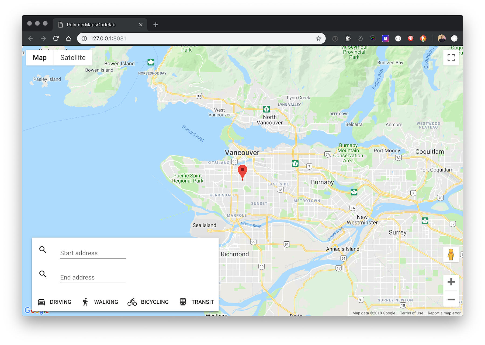

# Polymer Google Maps App

A Google Maps single page app built using elements from Polymer's [Google Web Components](https://elements.polymer-project.org/browse?package=google-web-components) collection. The app is responsive and will include driving directions and transit mode. Easy to integrate into an existing Polymer application





## Installation

You should have `node`, `npm`, `bower`, and `yarn` installed in your local dev environment.

Install npm modules

```bash
yarn install
```

Install Bower dependancies

```bash
bower install
```

**Or, you can use the `polymer-cli`**

```bash
polymer install
```


## Create a Google Maps API key

This app requires a Google Maps API key.  Here are the steps to get one:

- Sign up for Google Cloud Platform
- Setup billing
- Create a project
- Go the API directory and search for Google Maps
- Get a key for the Google Maps API

Once you you have the key, add it to the two components in `index.html` replacing the two instances of `api-key="ADD YOUR KEY HERE"`


## Develop

run 

```bash
polymer serve
```

to test the built app locally

run

```bash
polymer build
```

serve the `build/default` folder on local host.


## Deploy to gh-pages

First set up a github repo and commit the code base.

Run Gulp deploy

```bash
gulp deploy
```


## Caveats

This repo was built to learn Polymer it is not supported. It uses Polymer v.1 and as of this time the `google-web-components` have not been updated to support a later version.

TODO

- search box is not responsive (wrap it in toast?)


## References

[Build Google Maps Using Web Components & No Code!](https://codelabs.developers.google.com/codelabs/polymer-maps/index.html?index=..%2F..%2Findex#0)


